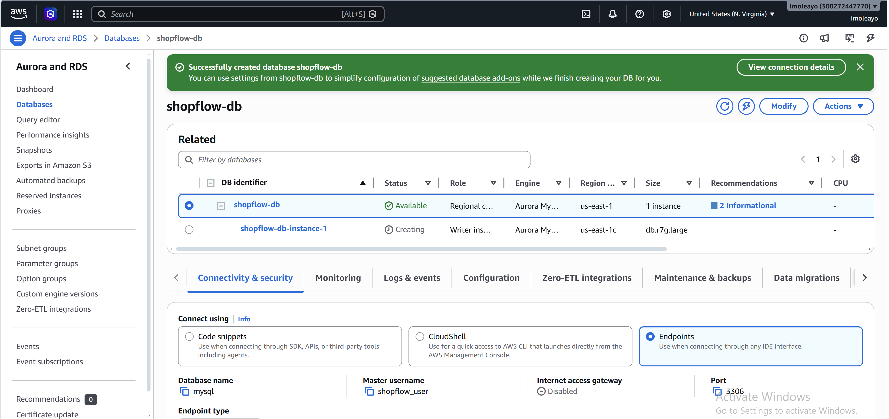
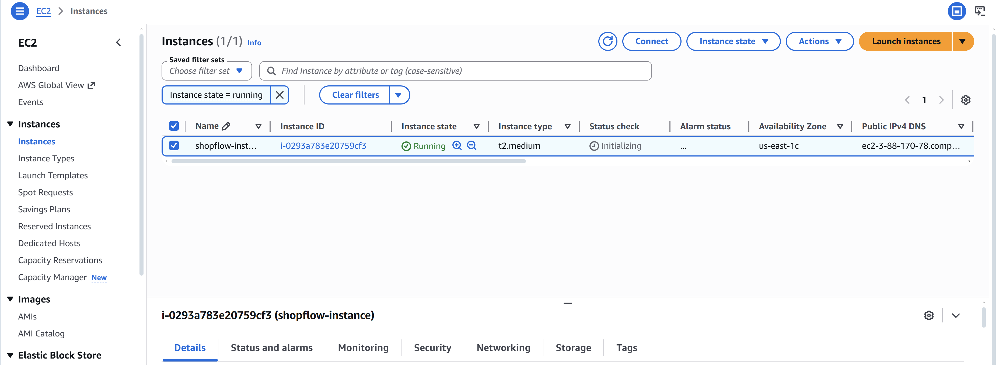
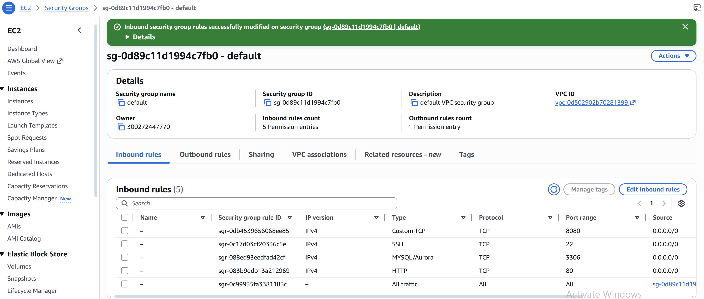
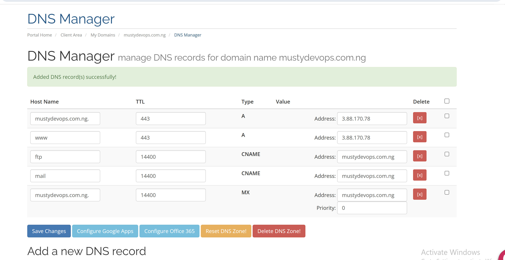
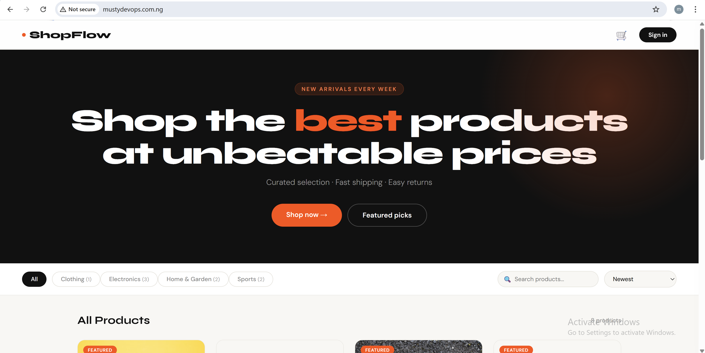
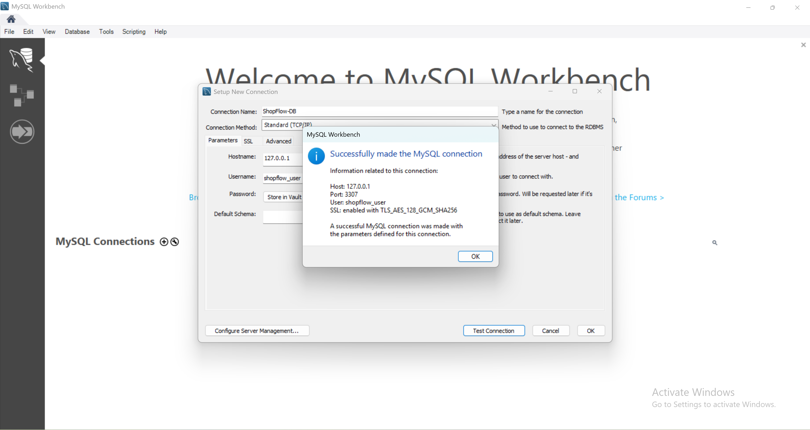
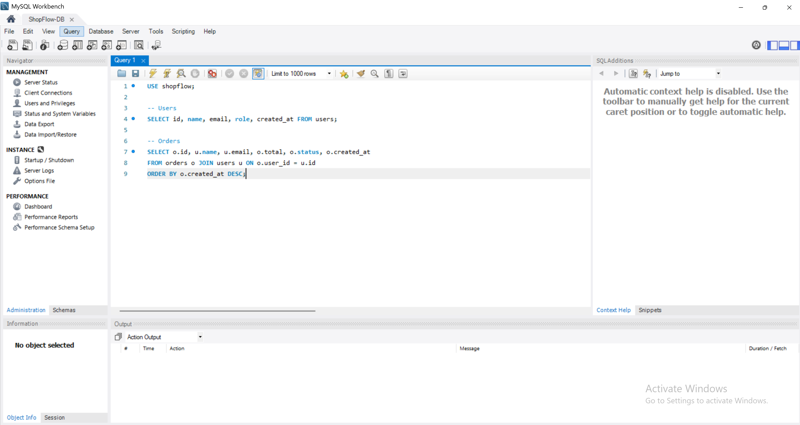

# 🛍 ShopFlow — E-Commerce App on EC2 + RDS MySQL

Full-stack e-commerce application: **Node.js + Express** backend, vanilla JS frontend, **AWS RDS MySQL** database, containerised with **Docker + docker-compose**, reverse proxied by **Nginx**.

---

## 📁 Project Structure

```
shopflow/
├── backend/
│   ├── config/
│   │   ├── db.js          # RDS MySQL connection pool
│   │   ├── migrate.js     # Creates all tables
│   │   └── seed.js        # Sample products & admin user
│   ├── middleware/
│   │   └── auth.js        # JWT auth + admin guard
│   ├── routes/
│   │   ├── auth.js        # POST /register /login GET /me
│   │   ├── products.js    # CRUD + search + pagination
│   │   ├── categories.js  # GET/POST categories
│   │   ├── cart.js        # GET/POST/PUT/DELETE cart
│   │   └── orders.js      # POST checkout, GET orders
│   ├── server.js          # Express entry point
│   └── package.json
├── frontend/
│   └── index.html         # Full SPA: products, cart, auth, checkout
├── nginx/
│   └── nginx.conf         # Reverse proxy to Node.js
├── Dockerfile             # Multi-stage build
├── docker-compose.yml     # app + nginx + dozzle
├── .env.example           # Environment variable template
└── deploy.sh              # EC2 bootstrap script
```

---

## ⚙️ AWS Setup

### Step 1 — Create RDS MySQL instance

1. **AWS Console → RDS → Create database**
2. Engine: **MySQL 8.0**
3. Template: **Free tier** (dev) or **Production**
4. DB identifier: `shopflow-db`
5. Master username: `shopflow_user`
6. Master password: choose a strong password and save it
7. Initial database name: leave blank — we create it manually after (see Step 4)
8. **VPC**: same VPC as your EC2 instance
9. **Public access**: No (EC2 accesses RDS privately via VPC)
10. **Security group**: attach the **same default SG** as your EC2, ensure port 3306 inbound is open

> ⚠️ **Important:** Do NOT set "Publicly accessible = Yes" unless you need remote GUI access. EC2 and RDS communicate privately via VPC — public access is not required.

Copy the **Endpoint** from RDS → Connectivity & security. It looks like:
```
shopflow-instance-1.ccpim4w6wbf2.us-east-1.rds.amazonaws.com
```
This goes in your `.env` as `DB_HOST`.

To find the **private IP** of RDS (needed for SSH tunnels), run this from EC2:
```bash
dig shopflow-instance-1.ccpim4w6wbf2.us-east-1.rds.amazonaws.com +short
# Returns e.g. 172.31.92.243
```

### Screenshot of RDS config:

> 

### Step 2 — Launch EC2

- AMI: **Ubuntu 22.04 LTS**
- Instance type: t3.small or t3.medium
- Key pair: create or select an existing `.pem` key — **save it, you need it to SSH in**
- Security Group inbound rules:

| Port | Protocol | Source | Purpose |
|------|----------|--------|---------|
| 22   | TCP | Your IP | SSH access |
| 80   | TCP | 0.0.0.0/0 | ShopFlow app |
| 8080 | TCP | Your IP | Dozzle log viewer |
| 3306 | TCP | 0.0.0.0/0 | RDS MySQL (add to default SG) |

- **VPC**: same VPC as RDS

- User data - optional 
```bash
#!/bin/bash

apt-get update
curl -fsSL https://get.docker.com | sudo sh
sudo usermod -aG docker ubuntu
newgrp docker

sudo curl -SL "https://github.com/docker/compose/releases/download/v2.27.0/docker-compose-linux-x86_64" \
  -o /usr/local/bin/docker-compose
sudo chmod +x /usr/local/bin/docker-compose
docker-compose --version

apt-get update
apt-get install -y certbot
```
### Step 3 — Configure security groups
- EC2 SG: allow inbound 22, 80, 8080 from your IP
- RDS SG: allow inbound 3306 from EC2 SG (or 0.
0.0.0/0 for testing, but not recommended for production)

### screenshot of EC2 config:
> 

### screenshot of EC2 security group:
> 

---

## 🚀 Deploy

### Step 1 — Clone the repo onto EC2

```bash
# SSH into EC2 from your local machine
chmod 400 ~/Downloads/your-key.pem
ssh -i ~/Downloads/your-key.pem ubuntu@<EC2-PUBLIC-IP>

# Clone into home directory (not /opt — avoid permission issues)
cd ~
git clone https://github.com/Musty2025x/shopflow.git
cd shopflow
ls
```

> ⚠️ **Do NOT clone into `/` or `/opt` directly** — you will get `Permission denied`.
> Always clone into your home directory `~` first.

### Step 2 — Configure .env

```bash
cp .env.example .env
vim .env
```

Paste this — no inline comments, no trailing spaces:

```env
NODE_ENV=production
PORT=5000
JWT_SECRET=shopflow-super-secret-key-32chars-minimum

DB_HOST=shopflow-instance-1.ccpim4w6wbf2.us-east-1.rds.amazonaws.com
DB_PORT=3306
DB_NAME=shopflow
DB_USER=shopflow_user
DB_PASSWORD=your-rds-password
DB_SSL=false

CORS_ORIGIN=*
```

> ⚠️ **Common .env mistakes that break the app:**
> - Inline comments on the same line as values e.g. `DB_SSL=false  # comment` — Node.js reads the comment as part of the value
> - Trailing spaces after values e.g. `DB_PORT=3306 ` — causes connection failures
> - Placeholder values left in e.g. `DB_HOST=your-rds-instance.xxxxxxxx...`

Save with `Ctrl+X` → `Y` → `Enter`

### Step 3 — Create the database on RDS

The app expects a database named `shopflow` to already exist. Create it manually:

```bash
# Install MySQL client
sudo apt-get install -y mysql-client

# Connect to RDS
mysql -h shopflow-instance-1.ccpim4w6wbf2.us-east-1.rds.amazonaws.com \
      -u shopflow_user -p
```

Inside the MySQL prompt:
```sql
CREATE DATABASE shopflow;
SHOW DATABASES;
EXIT;
```

> ⚠️ Every SQL command must end with a semicolon `;` — without it MySQL waits for more input on the next line.

### Step 4 — Update DNS records (optional)
If you have a domain name, point it to your EC2 instance's public IP using an A record. This allows you to access the app via `http://yourdomain.com` instead of the IP address.

> 

### Step 5 — Build and start

first u need to create shopflow database in RDS, then run the following commands to build and start the app:

ubuntu@ip-172-31-16-156:~/shopflow$ curl -o global-bundle.pem https://truststore.pki.rds.amazonaws.com/global/global-bundle.pem
  % Total    % Received % Xferd  Average Speed  Time    Time    Time   Current
                                 Dload  Upload  Total   Spent   Left   Speed
100 161.5k 100 161.5k   0      0  6.41M      0                              0
ubuntu@ip-172-31-16-156:~/shopflow$ mysql -h shopflow-db.cluster-ccpim4w6wbf2.us-east-1.rds.amazonaws.com -P 3306 -u shopflow_user -p --ssl-mode=VERIFY_IDENTITY --ssl-ca=./global-bundle.pem
Enter password:
Welcome to the MySQL monitor.  Commands end with ; or \g.
Your MySQL connection id is 402
Server version: 8.0.42 6252a59a

Copyright (c) 2000, 2026, Oracle and/or its affiliates.

Oracle is a registered trademark of Oracle Corporation and/or its
affiliates. Other names may be trademarks of their respective
owners.

Type 'help;' or '\h' for help. Type '\c' to clear the current input statement.

mysql> CREATE DATABASE shopflow;
Query OK, 1 row affected (0.00 sec)

mysql> exit;
Bye
ubuntu@ip-172-31-16-156:~/shopflow$


```bash
cd ~/shopflow
docker-compose up -d --build
sleep 15
docker logs shopflow_app
```

You should see:
```
ubuntu@ip-172-31-16-156:~/shopflow$ docker logs shopflow_app
✅ MySQL RDS connected → shopflow-db-instance-1.ccpim4w6wbf2.us-east-1.rds.amazonaws.com:3306/shopflow
🚀 ShopFlow API running on port 5000
   ENV: production
   DB:  shopflow-db-instance-1.ccpim4w6wbf2.us-east-1.rds.amazonaws.com/shopflow
ubuntu@ip-172-31-16-156:~/shopflow$
```

### Step 6 — Run migrations and seed

```bash
# Note: path is config/migrate.js NOT backend/config/migrate.js
# The Dockerfile sets WORKDIR to /app/backend already
docker-compose exec app node config/migrate.js
docker-compose exec app node config/seed.js
```

ubuntu@ip-172-31-16-156:~/shopflow$ docker-compose exec app node config/migrate.js
🔄 Running migrations...
  ✅ Table: users
  ✅ Table: categories
  ✅ Table: products
  ✅ Table: cart_items
  ✅ Table: orders
  ✅ Table: order_items
✅ All migrations complete
ubuntu@ip-172-31-16-156:~/shopflow$ docker-compose exec app node config/seed.js
🌱 Seeding database...
  ✅ Categories seeded
  ✅ Products seeded
  ✅ Admin user: admin@shopflow.com / admin123
✅ Seeding complete
ubuntu@ip-172-31-16-156:~/shopflow$

---

test the app:

curl http://localhost/health
curl http://localhost/api/products

## 🌐 Access

| URL | Description |
|-----|-------------|
| `http://<EC2-IP>/` | ShopFlow storefront |
| `http://<EC2-IP>/api/products` | Products API |
| `http://<EC2-IP>/health` | Health check |
| `http://<EC2-IP>:8080` | Dozzle log viewer |

**Default admin login:** `admin@shopflow.com` / `admin123`

### screenshot of app homepage:
> 

---

### Connecting to RDS MySQL from your local machine (optional)

by default, RDS is private and only accessible from EC2. To connect from your local machine (e.g. MySQL Workbench), set up an SSH tunnel through EC2:

```bash
ssh -i ~/.ssh/shopflow-key.pem \
    -L 3307:<RDS-PRIVATE-IP>:3306 \
    ubuntu@<EC2-PUBLIC-IP> -N &

output:

musty@Musty2025x MINGW64 ~
$ ssh -i ~/.ssh/shopflow-key.pem -L 3307:shopflow-db-instance-1.ccpim4w6wbf2.us-east-1.rds.amazonaws.com:3306 ubuntu@3.88.170.78 -N &
[1] 3683

---
### MySQL Workbench connection settings:
| Field | Value |
|-------|-------|
| Connection Method | Standard (TCP/IP) |
| Hostname | `127.0.0.1` |
| Port | `3307` |
| Username | `shopflow_user` |
| Password | your RDS password |

### screenshot of MySQL Workbench connection:
> 


USE shopflow;

-- Users
SELECT id, name, email, role, created_at FROM users;

-- Orders
SELECT o.id, u.name, u.email, o.total, o.status, o.created_at 
FROM orders o JOIN users u ON o.user_id = u.id 
ORDER BY o.created_at DESC;

### Dashboard screenshot:
> 

---

### 📡 API Reference

| Method | Endpoint | Auth | Description |
|--------|----------|------|-------------|
| POST | `/api/auth/register` | — | Register user |
| POST | `/api/auth/login` | — | Login |
| GET | `/api/auth/me` | ✅ | Get profile |
| GET | `/api/products` | — | List products (search, filter, page) |
| GET | `/api/products/:slug` | — | Product detail |
| POST | `/api/products` | Admin | Create product |
| PUT | `/api/products/:id` | Admin | Update product |
| DELETE | `/api/products/:id` | Admin | Delete product |
| GET | `/api/categories` | — | All categories |
| GET | `/api/cart` | ✅ | View cart |
| POST | `/api/cart` | ✅ | Add to cart |
| PUT | `/api/cart/:id` | ✅ | Update quantity |
| DELETE | `/api/cart/:id` | ✅ | Remove item |
| POST | `/api/orders` | ✅ | Place order (checkout) |
| GET | `/api/orders` | ✅ | My orders |
| GET | `/api/orders/all` | Admin | All orders |

---

## 🔧 Useful Commands

```bash
# Rebuild after code changes
docker-compose up -d --build

# View live logs
docker-compose logs -f app
docker-compose logs -f nginx

# Shell into app container
docker-compose exec app sh

# Re-run migrations (correct path — no backend/ prefix)
docker-compose exec app node config/migrate.js

# Restart single service
docker-compose restart app

# Check all container statuses
docker ps
```

---

## 🗄️ Viewing Database Data

### Option A — MySQL CLI on EC2 (quickest)

```bash
mysql -h shopflow-instance-1.ccpim4w6wbf2.us-east-1.rds.amazonaws.com \
      -u shopflow_user -p

USE shopflow;

-- All users
SELECT id, name, email, role, created_at FROM users;

-- All orders with customer info
SELECT o.id, u.name, u.email, o.total, o.status, o.created_at
FROM orders o JOIN users u ON o.user_id = u.id
ORDER BY o.created_at DESC;

-- Dashboard summary
SELECT
  (SELECT COUNT(*) FROM users WHERE role='customer') AS total_customers,
  (SELECT COUNT(*) FROM orders) AS total_orders,
  (SELECT SUM(total) FROM orders WHERE status != 'cancelled') AS revenue,
  (SELECT COUNT(*) FROM products) AS total_products;
```

### Option B — MySQL Workbench via SSH Tunnel (GUI)

RDS is private (not publicly accessible), so connect through an SSH tunnel:

```bash
# Run on your LOCAL machine (Git Bash) — keep this terminal open
ssh -i ~/.ssh/shopflow-key.pem \
    -L 3307:<RDS-PRIVATE-IP>:3306 \
    ubuntu@<EC2-PUBLIC-IP> -N &
```

To find the RDS private IP:
```bash
# Run on EC2
dig shopflow-instance-1.ccpim4w6wbf2.us-east-1.rds.amazonaws.com +short
```

Then in MySQL Workbench:

| Field | Value |
|-------|-------|
| Connection Method | Standard (TCP/IP) |
| Hostname | `127.0.0.1` |
| Port | `3307` |
| Username | `shopflow_user` |
| Password | your RDS password |

> ⚠️ Keep the Git Bash tunnel window open — closing it kills the connection.
> Use the DNS hostname (not private IP) in `.env` — AWS can change the private IP on restart.

---

## 🐛 Troubleshooting

### `Unknown database 'shopflow'`
**Cause:** The `shopflow` database was never created on RDS. RDS does not auto-create it.
**Fix:** Connect to RDS and create it manually:
```sql
CREATE DATABASE shopflow;
```

### `Cannot find module '/app/backend/backend/config/migrate.js'`
**Cause:** Dockerfile sets `WORKDIR /app/backend` so the path is already inside `backend/`.
**Fix:** Run migrations without the `backend/` prefix:
```bash
docker-compose exec app node config/migrate.js
```

### Container `shopflow_app` stays unhealthy, nginx won't start
**Cause:** `depends_on: condition: service_healthy` makes nginx wait for the health check to pass. If the health check times out nginx never starts.
**Fix:** Change the nginx dependency in `docker-compose.yml`:
```yaml
# Change this:
depends_on:
  app:
    condition: service_healthy

# To this:
depends_on:
  - app
```
Then increase the app health check `start_period` to `60s`.

### `.env` inline comments breaking connection
**Cause:** Node.js `dotenv` reads everything after `=` as the value including comments.
**Fix:** Never put inline comments in `.env`:
```env
# ❌ Wrong
DB_SSL=false    # set to true for production

# ✅ Correct
DB_SSL=false
```

---

## 🗂 GitLab Portfolio
```
gitlab.com/musty2025x/devops-portfolio-2025
└── shopflow-ec2-rds/
```