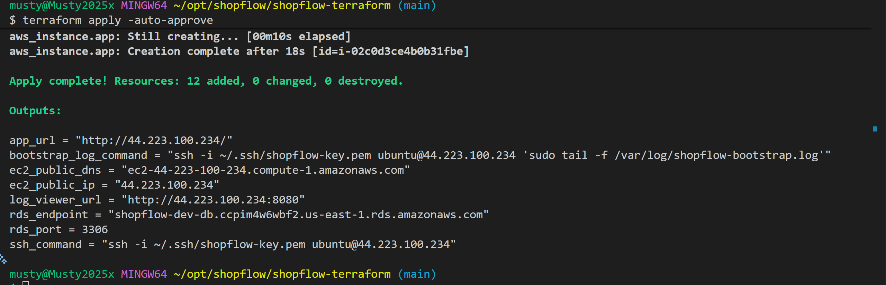

# 🛍 ShopFlow — Terraform Infrastructure

Provisions the complete AWS infrastructure for ShopFlow e-commerce app using Terraform — VPC, Subnets, Security Groups, EC2, and RDS MySQL. The app is deployed automatically via a user_data bootstrap script on EC2 launch.

---

## 📁 Project Structure

```
shopflow-terraform/
├── main.tf                    # VPC · Subnets · SGs · EC2 · RDS
├── variables.tf               # All input variables
├── outputs.tf                 # Outputs after apply
├── terraform.tfvars.example   # Copy → terraform.tfvars
├── .gitignore
├── scripts/
│   └── bootstrap.sh           # EC2 user_data — installs Docker, clones repo, starts app
└── README.md
```

---

## 🏗 What Terraform Provisions

```
AWS
├── VPC (10.0.0.0/16)
│   ├── Public Subnet  10.0.1.0/24  → EC2 (with IGW + Route Table)
│   ├── Private Subnet 10.0.2.0/24  → RDS AZ-a
│   └── Private Subnet 10.0.3.0/24  → RDS AZ-b
│
├── Security Groups
│   ├── EC2 SG  → allows 22, 80, 443, 8080 inbound
│   └── RDS SG  → allows 3306 from EC2 SG only
│
├── EC2 (Ubuntu 22.04, t3.small)
│   └── user_data → bootstrap.sh
│       ├── installs Docker + Docker Compose
│       ├── clones GitHub repo
│       ├── writes .env with RDS credentials
│       ├── waits for RDS to be ready
│       ├── creates database
│       ├── docker-compose up --build
│       ├── runs migrations + seed
│       └── prints live URL
│
└── RDS MySQL 8.0 (db.t3.micro)
    ├── private (not publicly accessible)
    ├── encrypted storage
    └── 7-day backup retention
```

---

## 🚀 Deploy

### Prerequisites

- Terraform >= 1.6 installed
- AWS CLI configured (`aws configure`)
- AWS key pair created → **EC2 → Key Pairs → Create**

### Step 1 — Configure variables

```bash
cd shopflow-terraform
cp terraform.tfvars.example terraform.tfvars
```

Edit `terraform.tfvars`:
```hcl
key_name      = "shopflow-key"              # your AWS key pair name
db_password   = "YourStrongPassword123!"    # RDS password
jwt_secret    = "shopflow-jwt-secret-32chars-minimum"
allowed_ssh_cidr = "YOUR_IP/32"            # curl ifconfig.me
repo_url      = "https://github.com/Musty2025x/shopflow.git"
```

### Step 2 — Deploy

```bash
terraform init
terraform plan
terraform apply
```

Type `yes` when prompted. **Takes 8–12 minutes** — RDS provisioning takes the longest.

### Step 3 — Watch bootstrap progress

After apply completes, Terraform prints your EC2 IP. Watch the bootstrap:

```bash
# Terraform prints this command for you:
ssh -i ~/.ssh/shopflow-key.pem ubuntu@<EC2-IP> 'sudo tail -f /var/log/shopflow-bootstrap.log'
```

### Step 4 — Access the app
```
🌐  App:        http://<EC2-IP>/
📋  Logs:       http://<EC2-IP>:8080
🔑  Admin:      admin@shopflow.com / admin123
```

---

## 📤 Outputs

After `terraform apply`:

```
ec2_public_ip        = "3.88.170.78"
app_url              = "http://3.88.170.78/"
log_viewer_url       = "http://3.88.170.78:8080"
ssh_command          = "ssh -i ~/.ssh/shopflow-key.pem ubuntu@3.88.170.78"
rds_endpoint         = "shopflow-dev-db.xxxx.us-east-1.rds.amazonaws.com"
bootstrap_log_command = "ssh ... 'sudo tail -f /var/log/shopflow-bootstrap.log'"
```

> 
> 
---

## MySQL Workbench via SSH Tunnel (GUI)

1. Open MySQL Workbench → New Connection
2. Connection Method: Standard TCP/IP over SSH
3. SSH Hostname: `<EC2-PUBLIC-IP>`
4. SSH Username: `ubuntu`
5. SSH Key File: `~/.ssh/shopflow-key.pem`
6. MySQL Hostname: `<RDS-PRIVATE-IP>`
7. MySQL Port: `3306`
8. Username: `shopflow_user`
9. Password: (leave blank, check "Store in Vault")
10. Test Connection → OK


## MySQL CLI via SSH Tunnel

```Query
USE shopflow;

-- Users
SELECT id, name, email, role, created_at FROM users;

-- Orders
SELECT o.id, u.name, u.email, o.total, o.status, o.created_at 
FROM orders o JOIN users u ON o.user_id = u.id 
ORDER BY o.created_at DESC;
```
> 

## 🗑 Tear Down

```bash
terraform destroy -auto-approve
```

Destroys all resources — EC2, RDS, VPC, SGs. RDS data is lost (skip_final_snapshot = true).

---

## 🔒 Security Notes

- RDS is in **private subnets** — not publicly accessible
- RDS SG only allows port 3306 **from EC2 SG** — not from internet
- Set `allowed_ssh_cidr` to your IP (`YOUR_IP/32`) not `0.0.0.0/0`
- Never commit `terraform.tfvars` — it contains DB password and JWT secret

---

## 🐛 Troubleshooting

**Bootstrap still running after apply:**
```bash
ssh -i ~/.ssh/shopflow-key.pem ubuntu@<EC2-IP>
sudo tail -f /var/log/shopflow-bootstrap.log
```

**App not reachable after bootstrap:**
```bash
docker ps                          # check containers running
docker logs shopflow_app           # check app logs
docker logs shopflow_nginx         # check nginx logs
```

**RDS connection refused:**
```bash
# Verify EC2 can reach RDS
nc -zv <RDS-ENDPOINT> 3306
```

---

## 🗂 GitLab Portfolio
```
gitlab.com/musty2025x/devops-portfolio-2025
└── shopflow-terraform/
```
